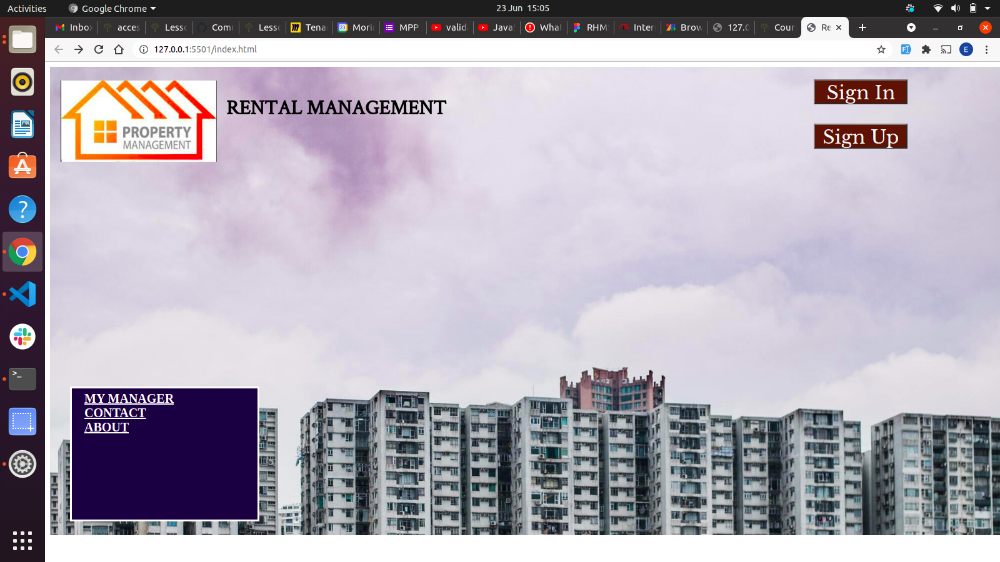
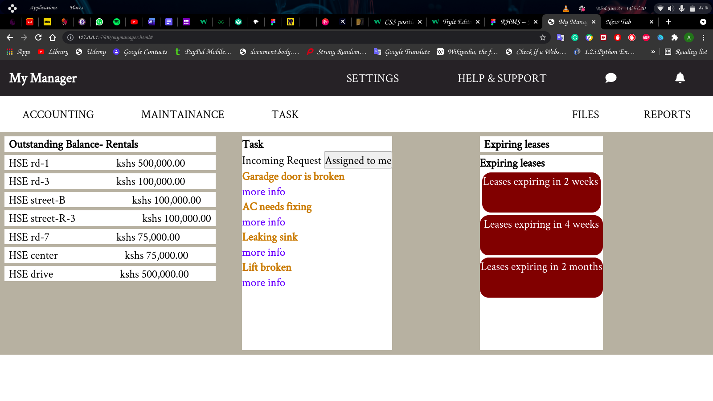
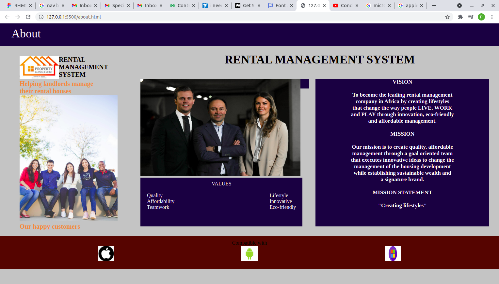

<h1 align="center">Welcome to Rental Management System</h1>
---
<h3 align="center">We help manage the landlords poroperty by creating a website which saves,calculates and providesan overview of the landloards pro
perty </h3>

  

  

## **🔭 I’m currently working on**
### **Rental Management System**
---
This is a project that brings an ease to the property owner.They say seeing is understanding. Basically the website explanation is in the screenshots below:
***
## Screenshots

---
The home page contains a sign up form for any new landlord. It also contain the links to the rest of the pages when clicked it opens thedestination clicked

### 👯 It's a group collaboration with
---
 ### Edwin Kithinji
 ### Keith James
 ### Peter Nduati
--- 
***
### 👨‍💻 All of our projects are available at;
---
### [edwinkim16@github](github.com/edwinkim16)
### [anthony64m@github](github.com/anthony64m)
### [freestyletear@github](github.com/freestyletear)
### [peterwanjihia@github](github.com/peterwanjihia)
***
---
### 💬 Ask me about 
---
### **JavaScript** 
### **HTML**
### **CSS**
***
---

### 📫 How to reach us
---
### **anthony.mutuku@student.moringaschool.com**
### **edwin.kithinji@students.moringaschool.com**
### **keith.james@students.moringaschool.com**
### **peter.wanjihia@students.moringaschool.com**
***
---
### ⚡ Fun fact 
---
**I think I'm funny**
***
---
<h3 align="left">Languages and Tools:</h3>

    

&nbsp;

